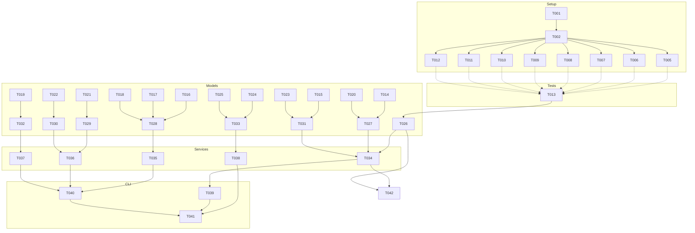

# Tasks: Plan‑to‑Execution Orchestrator (**Feature**: `001-create-a-structured`)

**FEATURE_DIR**: `specs/001-create-a-structured/`  
**Input**: Design documents from `specs/001-create-a-structured/`  
**Prerequisites**: `plan.md` (required), `research.md`, `data-model.md`, `quickstart.md`, `contracts/`

> Path conventions: Single project layout selected (repo root): `src/`, `tests/`, `.github/workflows/`, and `artifacts/` directories. See plan for structure.

## Execution Flow (summary of generator run)

1. Parsed tech stack, structure, and testing strategy from **plan.md** (TypeScript/Node, Vitest; single-project layout).
2. Extracted entities from **data-model.md** → model tasks.
3. Found contract file: **handoff-artifact.schema.json** → contract test task.
4. Extracted decisions from **research.md** (exclusive claims via claim file; deterministic schedule) → test targets & services.
5. Extracted scenarios from **quickstart.md** → integration tests.
6. Generated ordered tasks with TDD-first, [P] for parallel-safe, paths made explicit.
7. Built dependency graph and parallel run examples.
8. Validation checks applied; status: **SUCCESS** (tasks ready to run).

---

## Format: `[ID] [P?] Description`

- **[P]** mark = can run in parallel (different files, no dependency).
- Include exact file paths in descriptions.
- Tests **must** be written and fail before implementation tasks.

---

## Project Conventions

- Language: **TypeScript (Node 20+)**
- Test runner: **Vitest**
- Directory layout (root):
  - `src/models/`, `src/services/`, `src/cli/commands/`, `src/lib/`
  - `tests/contract/`, `tests/integration/`, `tests/unit/`, `tests/performance/`
  - `.github/workflows/`
  - `artifacts/{workflows,work-items,claims, schedule, handoff, gates, exports}/`

---

## Phase 3.1: Setup

- [ ] T001 Scaffold single-project layout per plan.md: create `src/{models,services,cli/commands,lib}`, `tests/{contract,integration,unit,performance}`, `artifacts/{workflows,work-items,claims,schedule,handoff,gates,exports}`, and `.github/workflows/`; add `.gitkeep` placeholders matching quickstart file expectations.
- [ ] T002 Initialize Node+TypeScript workspace: configure `package.json` scripts (`build`, `test`, `lint`, `format`, `check:schema`), install devDependencies (`typescript`, `ts-node`, `vitest`, `@types/node`, `eslint`, `@typescript-eslint/{parser,eslint-plugin}`, `prettier`, `ajv`, `yaml`) per plan; author `tsconfig.json` targeting ES2022 with `module`=`CommonJS`, `moduleResolution`=`Node`, baseline strictness (`noImplicitAny`, `strictNullChecks`), plus `vitest.config.ts` for Node runtime.
- [ ] T003 [P] Configure lint/format tooling: set up `.eslintrc.cjs` with `@typescript-eslint` recommended + strict rules (no-floating-promises, consistent-type-imports), integrate Prettier plugin, provide `.prettierrc` (2 spaces, 100 char width) and optional `lint-staged` hook; ensure tsconfig enables incremental builds and source maps to support FR-009 auditability.
- [ ] T004 [P] Seed `artifacts/` structure with representative stubs: add demo workflow (sequential step A, parallelizable steps B and C, finish step D) under `artifacts/workflows/`, bind sample work item in `artifacts/work-items/`, and create placeholder schedule, claim, gate, handoff, and exports files (schemaVersion `1.0`) to exercise quickstart scenarios.

---

## Phase 3.2: Tests First (TDD) ⚠️ MUST COMPLETE BEFORE 3.3

**Contract Test(s)**

- [ ] T005 [P] Contract test for handoff artifacts (FR-014): in `tests/contract/handoff_artifact_schema.test.ts` load `specs/001-create-a-structured/contracts/handoff-artifact.schema.json` via AJV draft-07, validate a compliant fixture covering enum `eventType` values and `baselineIntegration` states, and assert failures when required fields are omitted.

**Integration Tests (from quickstart & spec acceptance)**

- [ ] T006 [P] Deterministic scheduling integration test (FR-005, quickstart step 2): in `tests/integration/scheduling_determinism.test.ts` use the seeded workflow/work item to assert `scheduling_service` emits `artifacts/schedule/{workItemId}.json` with ready steps sorted by order, parallel branches B and C launched together, lexical tie-break by step key, and audit metadata captured.
- [ ] T007 [P] Exclusive claim semantics integration test (FR-027, research item 1): in `tests/integration/claim_semantics.test.ts` simulate two executors reading the same ready attempt, ensure `assignment_service` writes `artifacts/claims/{attemptId}.json` with executor metadata and rejects duplicate claims until terminal state, issuing new attempt identifiers on retry.
- [ ] T008 [P] Handoff artifact flow integration test (FR-014, FR-010): in `tests/integration/handoff_artifact_flow.test.ts` drive CLI/services to produce `artifacts/handoff/{timestamp}-{workItem}-{stepKey}-{attemptId}.json`, validate against schema, confirm baseline integration flag handling, and ensure the consumer reads the artifact before advancing.
- [ ] T009 [P] Gate review reject path integration test (FR-006, FR-021): in `tests/integration/gate_rework_flow.test.ts` cover `gate_service` writing `artifacts/gates/{workItem}/{gateKey}.json` with reject reasons, verify the work item rewinds to the target step, re-entry criteria are enforced, and the rework counter increments.
- [ ] T010 [P] Baseline integration boundary integration test (FR-010, FR-029): in `tests/integration/baseline_integration_boundary.test.ts` simulate attempt completion followed by a baseline integration artifact, assert re-execution requires an explicit revert artifact and the orchestrator enforces a single active session per work item.
- [ ] T011 [P] Portfolio exports integration test (FR-013, FR-017, FR-026): in `tests/integration/exports_snapshot.test.ts` invoke the export command to aggregate history and metrics into `artifacts/exports/{timestamp}.json` or `.csv`, asserting lead and cycle time, WIP, rework rate, gate decisions, and artifact links are present.

**Unit Tests (core rules)**

- [ ] T012 [P] Scheduling tie-break unit test (FR-005): in `tests/unit/scheduling_tiebreak.test.ts` verify `scheduling_service` sorts equal-order steps by lexical step key and produces deterministic `launchOrder` snapshots across runs.

---

## Phase 3.3: Core Implementation (ONLY after tests are failing)

**Models (from data-model.md) — one file per entity**

- [ ] T013 [P] Implement `src/models/workflow.ts` per data-model.md: define workflow id, name, version, and effective dates, hold ordered `Step[]`, enforce unique keys plus ascending order, and expose helpers (`getStep`, `listParallelizable`, `snapshotForAudit`).
- [ ] T014 [P] Implement `src/models/step.ts` capturing key, order, parallelizable flag, entryCriteria, exitCriteria, responsibleRole, and optional gate metadata; validate positive order and non-empty exit criteria.
- [ ] T015 [P] Implement `src/models/work_item.ts` with fields (id, workflowId, status enum, currentStepKey, owner, createdAt, updatedAt, links[]), methods to advance or rewind, compute pending exit criteria, and attach audit references (FR-002, FR-015).
- [ ] T016 [P] Implement `src/models/attempt.ts` including attemptId, workItemId, stepKey, status (`queued|running|completed|rejected|failed|rework`), timestamps, artifactLinks[], helper `isTerminal`, and factory for retry attempts honoring FR-027.
- [ ] T017 [P] Implement `src/models/assignment.ts` for exclusive claims (attemptId, executorId, claimedAt, releasedAt, terminalState); guard against multiple active assignments and record history per FR-027.
- [ ] T018 [P] Implement `src/models/executor.ts` capturing executor id, name, capacity (equals 1), and metadata with helpers to report availability and utilization for metrics.
- [ ] T019 [P] Implement `src/models/gate_review.ts` storing gate decision data (id, workItemId, stepKey, decision, reasons[], reviewer, timestamp) plus helper to determine re-entry status (FR-006).
- [ ] T020 [P] Implement `src/models/scheduling_decision.ts` to capture ready steps, launchOrder, assignments, timestamp, and rationale notes supporting audit requirements (FR-005, FR-009).
- [ ] T021 [P] Implement `src/models/handoff_artifact.ts` aligned with the schema (workflow, step, eventType, attemptId, timestamp, actor, outcome, nextAction, baselineIntegration, links, schemaVersion) with validation for the file naming pattern from research (FR-014).
- [ ] T022 [P] Implement `src/models/baseline_integration.ts` capturing baseline events (id or path, workItemId, timestamp, mergedBy, baseBranch) and references to related handoff artifacts enforcing FR-010.
- [ ] T023 [P] Implement `src/models/blocker.ts` (id, workItemId, type, startAt, optional endAt, owner, notes) including helpers to compute duration and impact metrics (FR-012).
- [ ] T024 [P] Implement `src/models/audit_record.ts` capturing immutable change history (id, entityType, entityId, who, what, why, when, prev?, next?) with linkage to git metadata (FR-009).
- [ ] T025 [P] Implement `src/models/metric_set.ts` storing scope (item, workflow, or portfolio) and measures {leadTime, cycleTimePerStep, throughput, WIP, reworkRate}; provide aggregation helpers for exports (FR-013).

**Services**

- [ ] T026 [P] Implement `src/services/workflow_registry.ts`: load YAML or JSON from `artifacts/workflows/`, validate with models (unique step keys, gate definitions, version windows), cache results, and expose lookup helpers for work items.
- [ ] T027 Implement `src/services/scheduling_service.ts` (FR-005, FR-028): compute deterministic ready steps, honor parallelizable flags, apply lexical tie-break, persist `SchedulingDecision` plus `artifacts/schedule/{workItemId}.json`, and emit audit records.
- [ ] T028 [P] Implement `src/services/assignment_service.ts` (FR-027): manage claim lifecycle by creating `artifacts/claims/{attemptId}.json` with executor metadata, block double claims, open retry attempts, and use `git_service` for commit and push.
- [ ] T029 [P] Implement `src/services/artifact_service.ts` (FR-014, FR-010): wrap AJV validation, build handoff payloads, write to `artifacts/handoff/` using the timestamp-workItem-stepKey-attemptId naming pattern, and register audit entries.
- [ ] T030 [P] Implement `src/services/git_service.ts`: detect the base branch (default `main`), provide commit and push with retry, log baseline integration events, and expose helpers for CLI and workflows per plan.md.
- [ ] T031 [P] Implement `src/services/work_item_service.ts`: manage lifecycle (status and currentStepKey), evaluate entry and exit criteria, coordinate re-entry after gates, and surface pending actions (FR-002, FR-015, FR-021).
- [ ] T032 [P] Implement `src/services/gate_service.ts`: process approve or reject decisions with reasons, enforce re-entry criteria, emit `GateReview` artifacts, and update work item state (FR-006, FR-021).
- [ ] T033 [P] Implement `src/services/metrics_service.ts`: compute lead and cycle times, throughput, WIP, and rework rate using attempts and blockers, and surface portfolio roll-ups for exports (FR-013, FR-017).

**CLI Commands (map to quickstart & research patterns)**

- [ ] T034 Extend `src/cli/commands/delegate.ts`: load workflow and work item context, call `scheduling_service`, write `artifacts/schedule/{workItemId}.json` including `launchOrder` and explanation fields, and echo a summary per quickstart step 2.
- [ ] T035 [P] Implement `src/cli/commands/claim.ts`: accept work item or attempt arguments, invoke `assignment_service` to create a claim artifact with executor metadata (machine name, Actions run id), commit via `git_service`, and confirm exclusive claim (FR-027).
- [ ] T036 [P] Implement `src/cli/commands/complete.ts`: finalize attempts, trigger `artifact_service` to write handoff artifacts (FR-014) with the naming pattern and baselineIntegration flag, update work item state, and optionally request baseline integration follow-up.
- [ ] T037 [P] Implement `src/cli/commands/gate.ts`: capture gate decisions (approve or reject) with reasons, call `gate_service`, persist `artifacts/gates/{workItem}/{gateKey}.json`, and on reject invoke `work_item_service` requeue logic (FR-006, FR-021).
- [ ] T038 [P] Implement `src/cli/commands/export.ts`: orchestrate `metrics_service` to produce portfolio and item snapshots, write `artifacts/exports/{timestamp}.json` (and CSV if requested) with filters (time range, workflow, owner) per spec FR-017.

---

## Phase 3.4: Integration

- [ ] T039 `.github/workflows/orchestrator.yml`: orchestrate a single job per plan.md that runs the delegate command, reads `artifacts/work-items/`, emits a matrix of ready attempts ordered by `launchOrder`, sets a concurrency key per work item, and uploads schedule artifacts for executors.
- [ ] T040 `.github/workflows/execute.yml`: define matrix executor jobs where each entry claims one attempt via the CLI, runs a step shell hook, calls `complete` and `gate` on finish, and handles failure by marking the attempt failed so the orchestrator requeues (quickstart steps 3 through 5, FR-028).
- [ ] T041 `.github/workflows/collector.yml`: optional collector job that downloads run artifacts or checks out the repo, aggregates new handoff, gate, and export files, commits via `git_service` with attempt references, preserving tamper-evident history (FR-029).
- [ ] T042 `src/lib/logger.ts`: provide structured logging with context fields (workItemId, attemptId, stepKey, executor, gitSha), JSON output for CI, and integration hooks for services and CLI.

---

## Phase 3.5: Polish

- [ ] T043 [P] Add `tests/unit/error_handling.test.ts` covering FR-025 recovery paths (invalid workflow state, missing artifacts, conflicting gate decisions) with expected user guidance.
- [ ] T044 Implement `tests/performance/scheduling_perf.test.ts` to stress `scheduling_service` across large workflows, asserting deterministic ordering and acceptable runtime under typical executor pool constraints.
- [ ] T045 [P] Refresh `specs/001-create-a-structured/quickstart.md` with CLI and CI command syntax and add `docs/ci-orchestration.md` documenting orchestrator, execute, and collector patterns, concurrency keys, artifact naming, and baseline integration flow (plan.md, research.md).
- [ ] T046 Perform code cleanup: remove duplication, tighten TypeScript types, add targeted doc comments for complex flows, ensure metrics and audit utilities are shared, and rerun lint and format commands.
- [ ] T047 Create `specs/001-create-a-structured/manual-testing.md` checklist covering quickstart steps 1 through 7, gate rejection, retry attempt flow, baseline integration validation, and export verification with expected artifacts and commands.

---

## Dependencies (summary)

- Phase 3.2 (T005–T012) **before** Phase 3.3 (T013–T038).
- Models (T013–T025) **block** services (T026–T033).
- Services (T026–T033) **block** CLI (T034–T038).
- CLI (T034–T038) **block** CI workflows (T039–T041) and most integration validations.
- Logging (T042) can proceed in parallel and be adopted incrementally.
- Polish (T043–T047) **after** implementations.

---

## Dependency Graph (Mermaid)



---

## Parallel Execution Examples

**Group A (after T002): run all failing tests in parallel**

```
npx vitest run tests/contract/handoff_artifact_schema.test.ts &
npx vitest run tests/integration/scheduling_determinism.test.ts &
npx vitest run tests/integration/claim_semantics.test.ts &
npx vitest run tests/integration/handoff_artifact_flow.test.ts &
npx vitest run tests/integration/gate_rework_flow.test.ts &
npx vitest run tests/integration/baseline_integration_boundary.test.ts &
npx vitest run tests/integration/exports_snapshot.test.ts &
npx vitest run tests/unit/scheduling_tiebreak.test.ts &
wait
```

**Group B (models in parallel)**

```
# Launch T013–T025 in parallel (distinct files)
```

**Group C (CLI commands in parallel)**

```
# T035, T036, T037, T038 are independent files and can run concurrently after services are ready.
```

---

## Validation Checklist (gate before “DONE”)

- [ ] All contract files have corresponding tests (handoff-artifact ✔).
- [ ] All entities in `data-model.md` have model tasks (Workflow, Step, WorkItem, Attempt, Assignment, Executor, GateReview, SchedulingDecision, HandoffArtifact, BaselineIntegration, Blocker, AuditRecord, MetricSet ✔).
- [ ] All tests are authored **before** implementation tasks.
- [ ] [P] tasks touch distinct files; no parallel write conflicts.
- [ ] Each task includes an explicit file path.
- [ ] CLI commands required by quickstart are implemented (delegate/claim/complete/gate/export).
- [ ] CI workflows exist to support orchestrated execution and artifact collection.

---

**Return**: **SUCCESS** — tasks are ready for execution.
