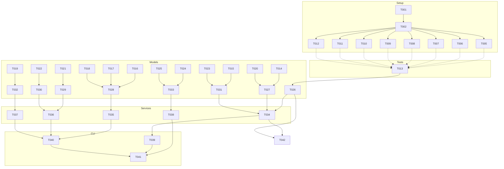

# Tasks: Plan‑to‑Execution Orchestrator (**Feature**: `001-create-a-structured`)

**FEATURE_DIR**: `specs/001-create-a-structured/`  
**Input**: Design documents from `specs/001-create-a-structured/`  
**Prerequisites**: `plan.md` (required), `research.md`, `data-model.md`, `quickstart.md`, `contracts/`

> Path conventions: Single project layout selected (repo root): `src/`, `tests/`, `.github/workflows/`, and `artifacts/` directories. See plan for structure.

## Execution Flow (summary of generator run)

1. Parsed tech stack, structure, and testing strategy from **plan.md** (TypeScript/Node, Vitest; single-project layout).
2. Extracted entities from **data-model.md** → model tasks.
3. Found contract file: **handoff-artifact.schema.json** → contract test task.
4. Extracted decisions from **research.md** (exclusive claims via claim file; deterministic schedule) → test targets & services.
5. Extracted scenarios from **quickstart.md** → integration tests.
6. Generated ordered tasks with TDD-first, [P] for parallel-safe, paths made explicit.
7. Built dependency graph and parallel run examples.
8. Validation checks applied; status: **SUCCESS** (tasks ready to run).

---

## Format: `[ID] [P?] Description`

- **[P]** mark = can run in parallel (different files, no dependency).
- Include exact file paths in descriptions.
- Tests **must** be written and fail before implementation tasks.

---

## Project Conventions

- Language: **TypeScript (Node 20+)**
- Test runner: **Vitest**
- Directory layout (root):
  - `src/models/`, `src/services/`, `src/cli/commands/`, `src/lib/`
  - `tests/contract/`, `tests/integration/`, `tests/unit/`, `tests/performance/`
  - `.github/workflows/`
  - `artifacts/{workflows,work-items,claims, schedule, handoff, gates, exports}/`

---

## Phase 3.1: Setup

- [ ] T001 Create project skeleton per implementation plan: `src/`, `tests/`, `.github/workflows/`, `artifacts/` (+ subfolders), add `.gitkeep` placeholders where needed.
- [ ] T002 Initialize Node+TypeScript project: `package.json`, `tsconfig.json`, `vitest.config.ts`; add scripts (`build`, `test`, `lint`, `format`); add devDeps: `typescript`, `vitest`, `@types/node`, `ts-node`, `eslint`, `prettier`, `ajv`.
- [ ] T003 [P] Configure lint/format: `.eslintrc.cjs`, `.prettierrc`, `lint-staged` (pre-commit optional), enforce strict TS in `tsconfig.json`.
- [ ] T004 [P] Seed `artifacts/` structure: `workflows/`, `work-items/`, `claims/`, `schedule/`, `handoff/`, `gates/`, `exports/` with example stub files for tests.

---

## Phase 3.2: Tests First (TDD) ⚠️ MUST COMPLETE BEFORE 3.3

**Contract Test(s)**

- [ ] T005 [P] Contract test: validate handoff artifact schema in `tests/contract/handoff_artifact_schema.test.ts` against `specs/001-create-a-structured/handoff-artifact.schema.json` using `ajv`.

**Integration Tests (from quickstart & spec acceptance)**

- [ ] T006 [P] Deterministic scheduling emission (sequential default; parallel branches; stable lexical tie‑break): `tests/integration/scheduling_determinism.test.ts` (reads `artifacts/workflows/*.yaml|json` and expects ordered `artifacts/schedule/{id}.json`).
- [ ] T007 [P] Exclusive claim semantics via claim file (one executor per attempt until terminal): `tests/integration/claim_semantics.test.ts` (creates `artifacts/claims/{attemptId}.json`, verifies re-queue on retry).
- [ ] T008 [P] Handoff artifact commit & consumption flow: `tests/integration/handoff_artifact_flow.test.ts` (produces `artifacts/handoff/*` and validates required fields + linkage).
- [ ] T009 [P] Gate review reject path → rework & re-entry criteria: `tests/integration/gate_rework_flow.test.ts` (writes `artifacts/gates/{workItem}/{gateKey}.json` and verifies step rewind).
- [ ] T010 [P] Baseline integration boundary semantics (pre→post integration rules, explicit revert before re-exec): `tests/integration/baseline_integration_boundary.test.ts`.
- [ ] T011 [P] Portfolio exports snapshot: `tests/integration/exports_snapshot.test.ts` (expects files under `artifacts/exports/` with item histories).

**Unit Tests (core rules)**

- [ ] T012 [P] Tie‑break by step key lexical order for equal indices: `tests/unit/scheduling_tiebreak.test.ts`.

---

## Phase 3.3: Core Implementation (ONLY after tests are failing)

**Models (from data-model.md)** — one file per entity

- [ ] T013 [P] `src/models/workflow.ts` (Workflow)
- [ ] T014 [P] `src/models/step.ts` (Step)
- [ ] T015 [P] `src/models/work_item.ts` (WorkItem)
- [ ] T016 [P] `src/models/attempt.ts` (Attempt)
- [ ] T017 [P] `src/models/assignment.ts` (Assignment)
- [ ] T018 [P] `src/models/executor.ts` (Executor)
- [ ] T019 [P] `src/models/gate_review.ts` (GateReview)
- [ ] T020 [P] `src/models/scheduling_decision.ts` (SchedulingDecision)
- [ ] T021 [P] `src/models/handoff_artifact.ts` (HandoffArtifact)
- [ ] T022 [P] `src/models/baseline_integration.ts` (BaselineIntegration)
- [ ] T023 [P] `src/models/blocker.ts` (Blocker)
- [ ] T024 [P] `src/models/audit_record.ts` (AuditRecord)
- [ ] T025 [P] `src/models/metric_set.ts` (MetricSet)

**Services**

- [ ] T026 [P] `src/services/workflow_registry.ts` — load & validate workflow defs from `artifacts/workflows/`.
- [ ] T027 [ ] `src/services/scheduling_service.ts` — deterministic schedule engine (FR‑005).
- [ ] T028 [P] `src/services/assignment_service.ts` — exclusive claims, retry→new attempt (FR‑027).
- [ ] T029 [P] `src/services/artifact_service.ts` — write/validate handoff artifacts; schema validation via AJV (FR‑014).
- [ ] T030 [P] `src/services/git_service.ts` — commit/push helpers; detect base branch for baseline integration.
- [ ] T031 [P] `src/services/work_item_service.ts` — track status, current step, remaining exit criteria.
- [ ] T032 [P] `src/services/gate_service.ts` — approve/reject with reasons; re-entry checks.
- [ ] T033 [P] `src/services/metrics_service.ts` — compute lead time, cycle time per step, throughput, WIP, rework rate.

**CLI Commands (map to quickstart & research patterns)**

- [ ] T034 [ ] Extend `src/cli/commands/delegate.ts` — compute schedule and emit `artifacts/schedule/{id}.json`.
- [ ] T035 [P] `src/cli/commands/claim.ts` — claim attempt and write `artifacts/claims/{attemptId}.json` with executor metadata.
- [ ] T036 [P] `src/cli/commands/complete.ts` — on completion, emit handoff artifact under `artifacts/handoff/`.
- [ ] T037 [P] `src/cli/commands/gate.ts` — record gate decision under `artifacts/gates/{workItem}/{gateKey}.json`.
- [ ] T038 [P] `src/cli/commands/export.ts` — write portfolio/item history snapshots to `artifacts/exports/`.

---

## Phase 3.4: Integration

- [ ] T039 `.github/workflows/orchestrator.yml` — single orchestrator job; emits matrix of ready attempts in stable launch order; set concurrency key per work item.
- [ ] T040 `.github/workflows/execute.yml` — matrix executor jobs; each claims one attempt (uses CLI `claim`), runs step, calls `complete` on finish.
- [ ] T041 `.github/workflows/collector.yml` — collector job to batch-commit produced artifacts (optional path if direct commits are disabled on runners).
- [ ] T042 `src/lib/logger.ts` — structured logging; wire into services/CLI.

---

## Phase 3.5: Polish

- [ ] T043 [P] Unit tests for error handling/recovery paths (invalid workflow state, missing artifacts): `tests/unit/error_handling.test.ts`.
- [ ] T044 Performance tests for schedule engine: `tests/performance/scheduling_perf.test.ts` (target: deterministic ordering; execution under typical constraints).
- [ ] T045 [P] Update docs: refresh `specs/001-create-a-structured/quickstart.md`; add `docs/ci-orchestration.md` covering GH Actions patterns.
- [ ] T046 Code cleanup: remove duplication, tighten types, doc comments.
- [ ] T047 Create & run manual checklist: `specs/001-create-a-structured/manual-testing.md` (cover quickstart flows).

---

## Dependencies (summary)

- Phase 3.2 (T005–T012) **before** Phase 3.3 (T013–T038).
- Models (T013–T025) **block** services (T026–T033).
- Services (T026–T033) **block** CLI (T034–T038).
- CLI (T034–T038) **block** CI workflows (T039–T041) and most integration validations.
- Logging (T042) can proceed in parallel and be adopted incrementally.
- Polish (T043–T047) **after** implementations.

---

## Dependency Graph (Mermaid)



---

## Parallel Execution Examples

**Group A (after T002): run all failing tests in parallel**

```
npx vitest run tests/contract/handoff_artifact_schema.test.ts &
npx vitest run tests/integration/scheduling_determinism.test.ts &
npx vitest run tests/integration/claim_semantics.test.ts &
npx vitest run tests/integration/handoff_artifact_flow.test.ts &
npx vitest run tests/integration/gate_rework_flow.test.ts &
npx vitest run tests/integration/baseline_integration_boundary.test.ts &
npx vitest run tests/integration/exports_snapshot.test.ts &
npx vitest run tests/unit/scheduling_tiebreak.test.ts &
wait
```

**Group B (models in parallel)**

```
# Launch T013–T025 in parallel (distinct files)
```

**Group C (CLI commands in parallel)**

```
# T035, T036, T037, T038 are independent files and can run concurrently after services are ready.
```

---

## Validation Checklist (gate before “DONE”)

- [ ] All contract files have corresponding tests (handoff-artifact ✔).
- [ ] All entities in `data-model.md` have model tasks (Workflow, Step, WorkItem, Attempt, Assignment, Executor, GateReview, SchedulingDecision, HandoffArtifact, BaselineIntegration, Blocker, AuditRecord, MetricSet ✔).
- [ ] All tests are authored **before** implementation tasks.
- [ ] [P] tasks touch distinct files; no parallel write conflicts.
- [ ] Each task includes an explicit file path.
- [ ] CLI commands required by quickstart are implemented (delegate/claim/complete/gate/export).
- [ ] CI workflows exist to support orchestrated execution and artifact collection.

---

**Return**: **SUCCESS** — tasks are ready for execution.
